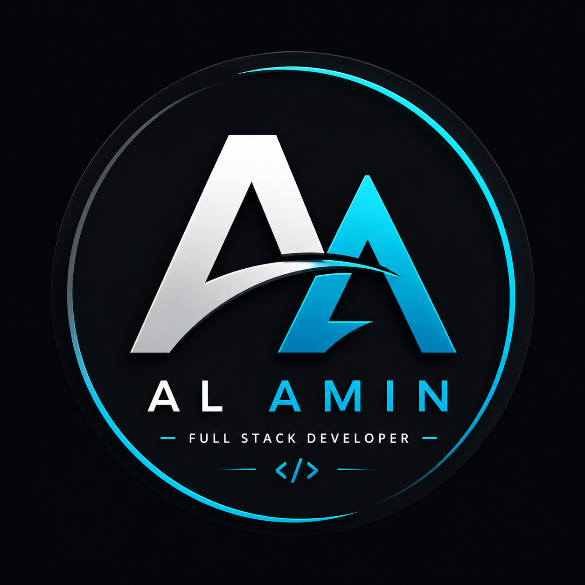

# 🚀 AL AMIN.dev — Personal Portfolio

<p align="center">
  
</p>

<h3 align="center">
  Modern Full Stack Developer Portfolio
</h3>

<p align="center">
  A modern, responsive, and interactive personal portfolio website built with Next.js and Tailwind CSS.
</p>

<p align="center">
  <a href="YOUR_LIVE_PORTFOLIO_URL" target="_blank">
    🌐 Live Portfolio
  </a>
  •
  <a href="YOUR_GITHUB_URL" target="_blank">
    💻 GitHub
  </a>
  •
  <a href="YOUR_LINKEDIN_URL" target="_blank">
    💼 LinkedIn
  </a>
</p>

---

## 👨‍💻 About Me

Hi, I'm **AL AMIN**, a passionate **Full Stack Web Developer** who enjoys building modern, responsive, and user-friendly web applications.

I love transforming ideas into functional digital products with clean UI, scalable architecture, and modern technologies.

My development journey focuses on:

- Modern frontend development
- Full-stack web applications
- Responsive UI/UX
- REST API development
- Authentication & authorization
- Database management
- Payment integration
- Dashboard development
- Continuous learning and problem solving

---

## ✨ Portfolio Highlights

This portfolio showcases my development journey, technical skills, educational background, projects, and contact information.

### Main Features

- ✅ Fully Responsive Design
- ✅ Modern Premium UI
- ✅ Dark / Light Mode
- ✅ Responsive Navigation Bar
- ✅ Hero / Introduction Section
- ✅ Professional Profile
- ✅ Resume Download
- ✅ Social Media Links
- ✅ About Me Section
- ✅ Skills Section
- ✅ Education Section
- ✅ Experience Section
- ✅ Projects Showcase
- ✅ Dynamic Project Details Pages
- ✅ Project Technology Stack
- ✅ Project Challenges
- ✅ Future Improvements
- ✅ Contact Section
- ✅ Back to Top Navigation
- ✅ Mobile Friendly Navigation
- ✅ Smooth Hover Animations
- ✅ Gradient Based Modern Design

---

# 🛠️ Technologies Used

### Frontend


### Backend & Database


### Tools & Services


---

# 📂 Featured Projects

## 🎫 TicketHub

A modern full-stack online ticket booking platform designed to provide users with a smooth and secure ticket booking experience.

### Features

- User authentication
- Role-based authentication
- Ticket browsing
- Ticket search
- Ticket booking
- Vendor dashboard
- Admin dashboard
- Ticket management
- User management
- Stripe payment integration
- Image upload
- Responsive UI
- Dark mode

### Technologies

- Next.js
- Tailwind CSS
- Node.js
- Express.js
- MongoDB
- Stripe

### Links

🌐 **Live:**  
https://ticket-hub-p6hh.vercel.app

💻 **Client / Repository:**  
https://github.com/arifislam121416/TicketHub

---

# 🩺 MediQueue

MediQueue is a modern doctor appointment booking platform designed to simplify appointment management between patients and doctors.

### Features

- User authentication
- Doctor browsing
- Appointment booking
- Booking management
- Private routes
- Responsive dashboard
- Doctor management
- Appointment management

### Technologies

- React
- Firebase
- Express.js
- MongoDB

### Links

🌐 **Live:**  
https://medique-client-mu.vercel.app

💻 **GitHub:**  
https://github.com/arifislam121416/mediqueflow-client

---

# 🎓 SkillSphere

SkillSphere is an online learning platform designed to connect students with educational content and provide instructors with course management capabilities.

### Features

- Authentication
- Course browsing
- Course enrollment
- Course management
- Student dashboard
- Instructor dashboard
- Admin management
- Responsive UI

### Technologies

- Next.js
- Tailwind CSS
- Node.js
- MongoDB

### Links

🌐 **Live:**  
https://skillsphere-e-course-platform-mr667ph2q.vercel.app

💻 **GitHub:**  
https://github.com/arifislam121416/skillsphere-E-Course-Platform

---

# 🎯 Skills

### Frontend

- HTML5
- CSS3
- JavaScript
- React.js
- Next.js
- Tailwind CSS
- Responsive Design

### Backend

- Node.js
- Express.js
- REST API
- Authentication
- Authorization

### Database

- MongoDB
- MongoDB Atlas

### Other

- Git
- GitHub
- Firebase
- Stripe
- Vercel
- REST API
- Responsive UI/UX

---

# 🎓 Education

My educational background and qualifications are presented in the dedicated **Education** section of the portfolio.

---

# 💼 Experience

My development experience comes from building real-world projects, continuously learning modern technologies, and solving practical development challenges.

My experience includes:

- Frontend Development
- Full Stack Development
- REST API Development
- Authentication Systems
- Dashboard Development
- Database Integration
- Payment Integration
- Responsive Web Design

---

# 📄 Resume

My resume is available directly from the portfolio.

You can download it using the **Resume** button available in the navigation bar and Hero section.

---

# 📱 Responsive Design

The portfolio is designed to provide a consistent experience across:

- 📱 Mobile
- 📱 Tablet
- 💻 Laptop
- 🖥️ Desktop

The navigation, cards, buttons, project sections, and layouts automatically adapt to different screen sizes.

---

# 🎨 Design

The portfolio uses a modern developer-focused visual style featuring:

- Cyan
- Indigo
- Purple

The primary CTA gradient:

```text
Cyan → Indigo → Purple